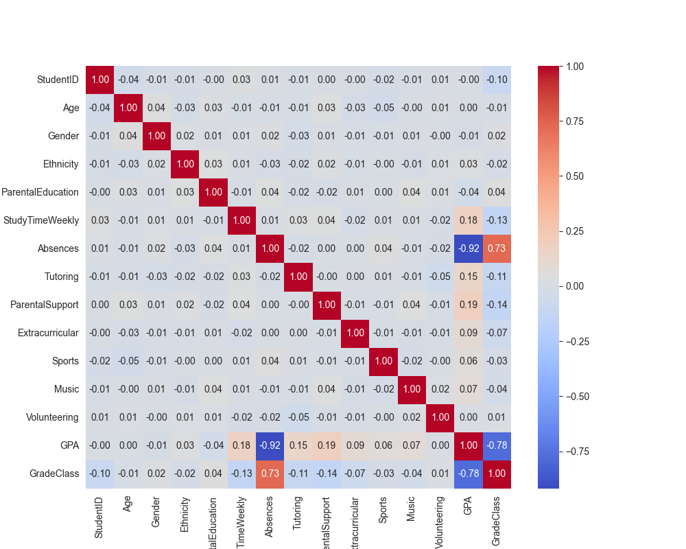

# Data Analysis Report
**Author:** Jose Pablo Garcia Meza

## Introduction

### Objective
The objective of this analysis is to develop a classification model to predict student performance based on various factors. This project focuses on selecting the most suitable model by evaluating multiple classification algorithms. The insights derived will aid stakeholders in understanding key factors influencing student success and optimizing intervention strategies.

## Dataset Overview
The dataset used for this analysis is the **Students Performance Dataset** from Kaggle. It contains multiple attributes related to students’ academic performance, such as test scores, parental education level, and study time. The goal is to analyze how these features contribute to predicting student success.

## Data Exploration and Preprocessing

### Exploratory Data Analysis (EDA)
- Summary statistics and visualizations were conducted to understand feature distributions and correlations. 
- Pair plots and correlation matrices indicated low correlation among most variables, suggesting complex relationships.

### Data Cleaning and Feature Engineering
As we are using the Student Performance Dataset from Kaggle, the data has already been pre-processed by the original user. This allowed us to skip the steps of handling missing values and encoding categorical variables. However, we still applied the following processing techniques:

- **Standardization:** The data was scaled to improve model performance, particularly for KNN and SVC, which are sensitive to feature scaling.  
- **Train-test split:** The dataset was divided into training and testing sets to ensure an unbiased model evaluation.

## Model Selection and Evaluation

### Models Trained
Four different classification models were trained and evaluated:

1. Support Vector Machine (SVC) with linear and RBF kernels.  
2. Random Forest Classifier.  
3. Gradient Boosting Classifier.  
4. K-Nearest Neighbors (KNN) for comparison.

### Performance Metrics

| Model                | Accuracy |
|---------------------|----------|
| Random Forest       | 0.7048   |
| Gradient Boosting   | 0.7156   |
| SVC (Linear Kernel) | 0.7574   |
| KNN                 | 0.6182   |

### Model Selection
SVC demonstrated the highest accuracy (0.7574), making it the preferred model due to its balance between interpretability and predictive power.

## Key Findings and Insights
- The dataset exhibits minimal linear relationships.  
- Feature scaling significantly impacted performance, improving results for SVC but negatively affecting KNN.  
- KNN underperformed, suggesting that proximity-based methods are not ideal for this dataset’s feature distribution.  
- SVC showed the best performance, although there is potential for further improvement. It requires greater computational resources.  
- Factors such as absences, parental support, weekly study time, volunteering, and involvement in music play a significant role in predicting student performance.

## Limitations and Future Steps

### Limitations
- The dataset may lack key features that could further improve predictive accuracy.  
- The class balance was not explicitly checked; imbalance could impact the model’s performance.  
- The analysis focused solely on accuracy; additional metrics like precision, recall, and F1-score should be explored.

### Future Steps
- Experiment with feature selection techniques to identify the most relevant predictors.  
- Explore additional preprocessing steps, such as balancing the dataset if necessary.  
- Consider hyperparameter tuning for SVC to further optimize performance.  
- Explore relationships between features and try training other models excluding irrelevant features.

## Conclusion
This analysis identified the **Support Vector Machine (SVC) with a linear kernel** as the best-performing model for predicting student performance, achieving the highest accuracy. While the model showed strong results, further optimization through hyperparameter tuning and feature selection could enhance performance.  

Future steps include addressing potential feature gaps, exploring additional metrics, and refining the model for better predictions. Overall, the findings provide valuable insights for stakeholders to improve student success strategies.

## Appendix

## Visualizations

### Distribución de Clases

### Matriz de Confusión - Random Forest

### Pairplot

### Heatmap de Correlación

### Feature Importance - SVC

